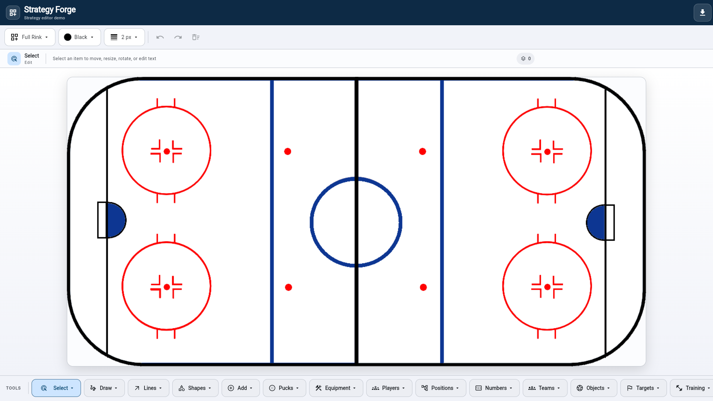

# Strategy Forge

[Pub.dev package](https://pub.dev/packages/strategy_forge) · [Live example app](https://marlenfranto.github.io/Strategy-Forge/) · [GitHub repository](https://github.com/Marlenfranto/Strategy-Forge) · [Issue tracker](https://github.com/Marlenfranto/Strategy-Forge/issues)

Strategy Forge gives Flutter teams a production-ready strategy editor they can embed and shape around their own product. It brings together drawing, tactical notation, object placement, precise transforms, responsive controls, undo history, portable JSON, and PNG generation behind one configurable API.

[](https://marlenfranto.github.io/Strategy-Forge/)

## Why developers choose Strategy Forge

### Ship a capable editor sooner

Use complete drawing and editing behavior without building gesture handling, selection geometry, transform controls, history, and export pipelines from the ground up. Users can create freehand paths, directional lines, shapes, multiline text, and markers, then move, scale, or rotate them with dedicated controls.

### Fit the editor to any strategy product

Your application supplies every layout as an asset, memory image, or widget, with its own aspect ratio and thumbnail. Layouts are defined during integration and passed into the editor, so the same package can support different surfaces, workflows, and terminology while the host application keeps control of the experience.

### Start with a complete, consistent toolbox

The catalog contains 86 canonical tools with stable IDs across selection, tactical paths, lines, shapes, text, and markers. Default SVG artwork and the bundled `CustomIcon.ttf` and `MyFlutterApp.ttf` fonts make every tool usable immediately. Developers can enable only the tools a view needs and replace any toolbar icon or marker renderer with product-specific artwork.

### Preserve visual detail while giving users control

Configurable colors and stroke widths apply consistently across drawing tools. Multicolor SVG markers replace only their declared primary color, preserving outlines and secondary details, while **Default / Clear** restores the original artwork.

### Keep strategy data portable

Versioned JSON import and export use normalized coordinates, making saved strategies independent of the current viewport size. PNG generation supports a configurable pixel ratio for previews, downloads, and sharing. The host receives JSON and image bytes through callbacks and can store them in any local or remote system.

### Integrate with the architecture you already use

`StrategyEditorController` provides programmatic document, history, import, and export control. Set `showControls: false` to build a completely custom surrounding interface. Storage, sharing, state management, navigation, and backend choices remain with the embedding application.

### Deliver polished interaction across Flutter targets

Responsive controls adapt to compact, short, tablet, and desktop constraints. Touch-friendly targets, semantic labels, desktop cursors, separate scale and rotation handles, rotated selection frames, undo, redo, layout switching, and confirmed clearing provide a consistent editing experience across supported Flutter platforms.

## Requirements and dependencies

The current package version is `0.1.0`. It requires Dart `^3.6.0` and Flutter 3.27 or later because it uses Flutter's wide-gamut color APIs.

| Dependency | Purpose |
| --- | --- |
| Flutter SDK | Widgets, gestures, painting, image capture, and platform rendering. |
| `flutter_svg ^2.3.0` | Bundled and host-provided SVG tool artwork. |
| `flutter_lints ^6.0.0` | Development lint rules. |
| `flutter_test` | Package unit and widget tests. |

The package itself does not depend on file-system, sharing, networking, database, or state-management libraries.

## Installation

Install the published package from [pub.dev](https://pub.dev/packages/strategy_forge):

```sh
flutter pub add strategy_forge
```

Or add the hosted dependency directly to the host app's `pubspec.yaml`:

```yaml
dependencies:
  strategy_forge: ^0.1.0
```

Then fetch dependencies:

```sh
flutter pub get
```

Import the public library:

```dart
import 'package:strategy_forge/strategy_forge.dart';
```

To test unreleased changes from the repository, use the Git dependency:

```yaml
dependencies:
  strategy_forge:
    git:
      url: https://github.com/Marlenfranto/Strategy-Forge.git
      path: packages/strategy_forge
```

## Quick start

The controller belongs to the host screen. Create it once, render the editor in bounded space, and dispose it with the screen:

```dart
import 'package:flutter/material.dart';
import 'package:strategy_forge/strategy_forge.dart';

class StrategyScreen extends StatefulWidget {
  const StrategyScreen({super.key});

  @override
  State<StrategyScreen> createState() => _StrategyScreenState();
}

class _StrategyScreenState extends State<StrategyScreen> {
  late final StrategyEditorController controller;

  @override
  void initState() {
    super.initState();
    final config = StrategyEditorConfig(
      id: 'training_view',
      name: 'Training view',
      layouts: [
        StrategyLayout.asset(
          id: 'full',
          label: 'Full layout',
          assetPath: 'assets/layouts/full.png',
          aspectRatio: 2,
        ),
      ],
      tools: StrategyToolCatalog.selectByIds(const [
        'select',
        'freehand',
        'arrow',
        'dashed_arrow',
        'rectangle',
        'text',
        'team_home',
        'team_away',
        'equipment_cone',
      ]),
    );
    controller = StrategyEditorController(config: config);
  }

  @override
  void dispose() {
    controller.dispose();
    super.dispose();
  }

  @override
  Widget build(BuildContext context) {
    return Scaffold(
      body: SafeArea(
        child: StrategyEditor(controller: controller),
      ),
    );
  }
}
```

Declare the host layout under `flutter.assets` in the host app:

```yaml
flutter:
  assets:
    - assets/layouts/
```

`StrategyEditor` expands inside its parent. Place it in a `Scaffold` body, `Expanded`, or another widget that gives it finite width and height.

## Responsibility split

| Package | Embedding application |
| --- | --- |
| Canvas gestures and rendering | Layout images and layout selection policy |
| Built-in editing tools and default icons | Enabled tool set for each view |
| Document model and versioned JSON | Persistence, synchronization, and migrations |
| PNG byte generation | Download, upload, sharing, and file naming |
| Responsive built-in controls | App shell, navigation, authentication, and branding |
| Tool ID aliases | Product-specific presets and strategy categories |

## Configuration reference

### `StrategyEditorConfig`

| Property | Required | Description |
| --- | --- | --- |
| `id` | Yes | Stable configuration identifier stored in every document. |
| `name` | Yes | Host-facing name for the configured editor. |
| `layouts` | Yes | Non-empty list of host-defined layouts. IDs must be unique. |
| `tools` | Yes | Non-empty list of enabled placement and editing tools. IDs must be unique. The first tool is initially active. |
| `markerRenderers` | No | Marker definitions used to render existing document markers even when their placement tools are hidden. Defaults to enabled marker tools. |
| `colors` | No | Non-empty palette. Defaults to black, red, orange, green, blue, and white. The first color is initially selected and is the drawing fallback after clearing the selection. |
| `strokeWidths` | No | Non-empty list of positive widths. Defaults to `2`, `4`, `6`, and `8`. The first width is initially selected. |

Construction rejects empty lists, duplicate layout or tool IDs, non-positive stroke widths, and non-marker entries in `markerRenderers`.

### Layouts

Every `StrategyLayout` has a stable `id`, visible `label`, positive `aspectRatio`, and widget `builder`. An optional `thumbnailBuilder` appears in the built-in layout menu.

#### Host asset

```dart
StrategyLayout.asset(
  id: 'full_field',
  label: 'Full field',
  assetPath: 'assets/layouts/full_field.png',
  aspectRatio: 16 / 9,
  fit: BoxFit.fill,
)
```

The asset belongs to the host and must be declared by the host. Set `package:` only when the layout is shipped by another Flutter package.

#### Memory bytes

```dart
StrategyLayout.memory(
  id: 'generated_layout',
  label: 'Generated layout',
  bytes: pngBytes,
  aspectRatio: 4 / 3,
)
```

This accepts bytes already supplied by the host while constructing the configuration. Strategy Forge does not provide an upload or picker UI.

#### Any widget

```dart
StrategyLayout(
  id: 'diagram',
  label: 'Diagram',
  aspectRatio: 2,
  builder: (_) => const CustomPaint(painter: DiagramPainter()),
  thumbnailBuilder: (_) => const Icon(Icons.map_outlined),
)
```

Layout IDs are serialized. Renaming or removing them makes existing documents incompatible unless the host migrates the JSON first.

### Choose enabled tools

Use the catalog list that matches the desired level of control:

| API | Contents |
| --- | --- |
| `StrategyToolCatalog.core` | One tool for each distinct editing behavior. |
| `StrategyToolCatalog.svgTools` | 34 original SVG palette markers. |
| `StrategyToolCatalog.universalMarkerTools` | 29 generic team, object, target, and training markers. |
| `StrategyToolCatalog.universalTools` | Current universal tool set; equivalent to `universalMarkerTools`. |
| `StrategyToolCatalog.all` | All 86 canonical entries in stable display order. |
| `StrategyToolCatalog.select(kinds)` | Core tools selected by `StrategyToolKind`. |
| `StrategyToolCatalog.selectByIds(ids)` | Any tools selected by canonical ID or supported alias. Unknown IDs throw `ArgumentError`. |
| `StrategyToolCatalog.tool(kind)` | One core tool for a behavior. |
| `StrategyToolCatalog.toolById(id)` | One catalog tool by canonical ID or alias. |

Example:

```dart
final tools = StrategyToolCatalog.selectByIds(const [
  'select',
  'freehand_arrow',
  'dashed_stop_arrow',
  'text',
  'object_round_ball',
  'target_goal',
]);
```

The package has no sport presets. Keep product-specific tool lists in the embedding app.

### Keep hidden markers renderable

An existing document can contain markers that are no longer offered for placement. Pass their definitions through `markerRenderers`:

```dart
final enabled = StrategyToolCatalog.selectByIds(const [
  'select',
  'arrow',
  'text',
]);

final config = StrategyEditorConfig(
  id: 'training_view',
  name: 'Training view',
  layouts: layouts,
  tools: enabled,
  markerRenderers: StrategyToolCatalog.all
      .where((tool) => tool.kind == StrategyToolKind.marker)
      .toList(),
);
```

This keeps historical markers visible without adding their tools to the toolbar.

## Built-in tool catalog

Groups with no enabled tools are omitted automatically. Core tools without an explicit group appear under Edit, Draw, Lines, Shapes, or Add. Bundled marker tools define their own group.

### Core tools

| Group | Stable IDs |
| --- | --- |
| Edit | `select` |
| Draw | `freehand`, `freehand_arrow`, `freehand_dashed_arrow`, `freehand_stop_arrow`, `lateral`, `lateral_stop`, `backwards`, `wave`, `double_arrow`, `dashed_double_arrow` |
| Lines | `line`, `arrow`, `stop_arrow`, `dashed_line`, `dashed_arrow`, `dashed_stop_arrow` |
| Shapes | `rectangle`, `filled_rectangle`, `ellipse`, `filled_ellipse` |
| Add | `text`, `marker` |

### Original SVG marker palettes

| Group | Stable IDs |
| --- | --- |
| Pucks | `puck`, `puck_group` |
| Equipment | `equipment_cone`, `equipment_tire`, `equipment_stick`, `equipment_stickhandling`, `equipment_triangle`, `equipment_border_vertical`, `equipment_border_horizontal` |
| Nets | `net_up`, `net_down`, `net_right`, `net_left`, `net_mini` |
| Players | `player_forward`, `player_defense`, `player_opponent`, `player_type_1`, `player_type_2`, `player_type_x` |
| Positions | `position_center`, `position_left_wing`, `position_right_wing`, `position_left_defense`, `position_right_defense` |
| Numbers | `number_1` through `number_9` |

### Universal marker palettes

| Group | Stable IDs |
| --- | --- |
| Teams | `team_home`, `team_away`, `team_neutral`, `role_goalkeeper`, `role_official`, `role_substitute`, `role_coach`, `role_possession` |
| Objects | `object_round_ball`, `object_oval_ball`, `object_small_ball`, `object_disc`, `object_shuttlecock`, `object_curling_stone`, `object_bat`, `object_racket`, `object_broom` |
| Targets | `target_goal`, `target_hoop`, `target_net`, `target_wicket`, `target_base`, `target_bullseye`, `target_flag` |
| Training | `training_hurdle`, `training_pole`, `training_ladder`, `training_mannequin`, `training_zone` |

Puck, stick, and cone remain in their original palettes to avoid duplicate tools with identical artwork.

### Compatibility aliases

Former duplicate IDs resolve to one canonical tool when using `toolById`, `selectByIds`, or `canonicalIdFor`:

| Former IDs | Canonical ID |
| --- | --- |
| `action_move`, `action_carry` | `freehand_arrow` |
| `action_pass`, `action_return` | `dashed_arrow` |
| `action_dribble`, `action_sweep` | `wave` |
| `action_shot`, `action_serve` | `arrow` |
| `action_screen` | `stop_arrow` |
| `action_press` | `freehand_dashed_arrow` |
| `action_rotate` | `double_arrow` |
| `forward_*`, `defense_*` player variants | Corresponding `player_*` ID |
| `object_puck` | `puck` |
| `object_stick` | `equipment_stick` |
| `training_cone` | `equipment_cone` |
| `position_goalie` | `role_goalkeeper` |
| `position_coach` | `role_coach` |

Use canonical IDs in newly persisted application data. Catalog aliases help with configuration code; arbitrary saved JSON is not rewritten automatically.

## Editing behavior

### Drawing and line notation

- Freehand tools follow the complete pointer path.
- Straight line tools use the gesture start and end positions.
- Solid and dashed variants have distinct rendering.
- Freehand dashed, straight dashed, lateral, and backwards notation retain their intended cadence and shape.
- Stop arrows combine an open arrowhead with stop bars.
- Two-way arrows place independently oriented heads at both rendered endpoints.
- Arrow direction is calculated from a short path sample to reduce pointer-jitter errors.
- Lateral arrows use the final rendered segment for arrowhead orientation.
- Outline and filled rectangles and ellipses use the drag bounds.

All document coordinates are normalized to the layout, so drawings scale with the available editor size.

### Text

Select `text` and tap the canvas to open the multiline editor. The built-in dialog accepts up to 240 characters. Select an existing text item and use its edit control to update the content. Text can also be moved, scaled, and rotated.

### Selection and transforms

Select `select`, then tap an element. The editor supports:

- dragging the selected item to reposition it;
- dragging a square corner handle to scale it without rotating;
- dragging the separate round handle to rotate it without scaling;
- pinch scaling on touch devices;
- 15-degree rotation buttons;
- 10% scale buttons, constrained to 25%–400%;
- an edit action when the selected element is text;
- move, resize, grab, and grabbing cursors on pointer platforms.

The selection frame follows the element's rotation. Transform changes enter the normal undo history.

### History and clearing

Layout changes and document edits are undoable. New edits clear the redo stack. `loadDocument` and `loadJson` start a fresh history. The built-in Clear button asks for confirmation and removes every element from the current document.

## Icons, markers, and color behavior

Every catalog tool has a default icon. The package includes its SVG assets and the `MyFlutterApp` and `CustomIcon` font families, so host apps do not need to copy those files.

### Override one toolbar icon

```dart
final arrow = StrategyToolCatalog
    .tool(StrategyToolKind.arrow)
    .withIconBuilder((_) => const Icon(Icons.star));
```

Use the returned tool in the configuration. `iconBuilder` can return any Flutter widget. When `iconBuilder`, `icon`, and icon SVG properties are absent, the package falls back to `StrategyToolIcons.forKind(kind)`.

### Define a custom marker

```dart
const customGroup = StrategyToolGroup(
  id: 'custom',
  label: 'Custom',
  icon: Icons.extension_outlined,
);

final checkpoint = StrategyTool(
  id: 'checkpoint',
  label: 'Checkpoint',
  kind: StrategyToolKind.marker,
  group: customGroup,
  markerSize: 40,
  iconBuilder: (_) => const Icon(Icons.location_on_outlined),
  markerBuilder: (_) => const Icon(Icons.location_on, size: 40),
);
```

Custom marker IDs are serialized. Keep them stable and keep a renderer available for saved documents.

### Use a custom SVG marker

```dart
final marker = StrategyTool(
  id: 'custom_target',
  label: 'Custom target',
  kind: StrategyToolKind.marker,
  group: StrategyToolCatalog.targetsGroup,
  markerSize: 44,
  svgAssetPath: 'assets/markers/custom_target.svg',
  primarySvgColor: const Color(0xffd94b4b),
);
```

Declare the SVG in the host app. Set `svgAssetPackage` if the file belongs to another package. `iconSvgAssetPath` and `iconSvgAssetPackage` can supply different toolbar artwork.

### Selected color rules

- A newly drawn stroke or text element stores the effective selected color.
- A newly placed marker stores an explicit color only when a palette color is selected.
- Choosing **Default / Clear** sets `selectedColor` to `null`. Markers then keep their source artwork; drawing and text tools use the first configured palette color.
- Bundled multicolor SVGs replace only the declared `primarySvgColor`. Other colors, outlines, lettering, and highlights remain unchanged.
- A custom SVG without `primarySvgColor` is tinted as a complete image for compatibility.
- A custom `markerBuilder` is color-filtered as a complete widget when an explicit color is selected.
- Changing the active color affects newly created elements. It does not rewrite existing document elements.

`StrategyToolAssets` exposes public constants for bundled SVG paths. `StrategyToolIcons`, `MyFlutterApp`, and `CustomIcon` expose the package icon APIs.

## Controller API

Create one `StrategyEditorController` per active editor view.

| Member | Purpose |
| --- | --- |
| `config` | Immutable configuration associated with the controller. |
| `document` | Current immutable `StrategyDocument`. |
| `toolId` / `tool` | Current tool selection. |
| `selectedColor` | Explicit color, or `null` when tool defaults are active. |
| `color` | Effective drawing color; falls back to the first configured color. |
| `strokeWidth` | Current configured line width. |
| `canUndo` / `canRedo` | History availability. |
| `selectTool(id)` | Activates a configured tool. |
| `selectColor(color)` / `clearColor()` | Changes or clears the explicit color. |
| `selectStrokeWidth(width)` | Activates a configured width. |
| `selectLayout(id)` | Changes the document layout and records history. |
| `addElement(element)` | Adds an element and records history. |
| `replaceElement(index, element)` | Replaces an element and records history. |
| `clear()` | Removes all elements and records history. |
| `undo()` / `redo()` | Navigates document history. |
| `loadDocument(document)` | Validates and loads a document, then clears history. |
| `exportJson()` / `loadJson(source)` | Serializes or restores a versioned document. |
| `exportPng(pixelRatio: 2)` | Captures the mounted editor content as PNG bytes. |

Selection methods validate their values against the configuration. Invalid tool IDs, layout IDs, colors, widths, and element indexes throw standard Dart errors.

## Callbacks and host state

The controller is a `ChangeNotifier`, so the host can convert document changes into callbacks without coupling the package to a state-management library. Controller notifications also occur for tool, color, and width selection; compare JSON to avoid redundant persistence writes:

```dart
String? lastExportedJson;

void emitDocumentIfChanged() {
  final json = controller.exportJson();
  if (json == lastExportedJson) return;
  lastExportedJson = json;
  onStrategyJsonChanged(json);
}

@override
void initState() {
  super.initState();
  controller.addListener(emitDocumentIfChanged);
}

@override
void dispose() {
  controller.removeListener(emitDocumentIfChanged);
  controller.dispose();
  super.dispose();
}
```

Generate an image and forward it to a host callback:

```dart
Future<void> generatePreview() async {
  final bytes = await controller.exportPng(pixelRatio: 2);
  onStrategyImageGenerated(bytes);
}
```

The repository's [`DemoHome`](https://github.com/Marlenfranto/Strategy-Forge/blob/main/packages/strategy_forge/example/lib/main.dart) implements ready-to-use `strategyJson`, `onStrategyJsonChanged`, `onStrategyImageGenerated`, `initialDownloadEnabled`, and `savePng` properties.

## JSON import and export

### Export and restore

```dart
final source = controller.exportJson();

// Store `source` in the host app, then restore it later.
controller.loadJson(source);
```

The current schema version is `1`:

```json
{
  "version": 1,
  "configId": "training_view",
  "layoutId": "full",
  "elements": [
    {
      "type": "stroke",
      "kind": "arrow",
      "points": [[0.2, 0.3], [0.6, 0.5]],
      "color": 4278190080,
      "width": 4.0
    },
    {
      "type": "text",
      "position": [0.4, 0.2],
      "text": "First line\nSecond line",
      "color": 4278190080,
      "fontSize": 16.0,
      "rotation": 0.25,
      "scale": 1.2
    },
    {
      "type": "marker",
      "position": [0.7, 0.6],
      "toolId": "team_home",
      "color": 4278233770
    }
  ]
}
```

### Schema details

- Coordinates are normalized fractions of layout width and height.
- Colors are Flutter 32-bit ARGB integer values.
- Stroke `kind` uses the `StrategyToolKind` enum name.
- Text and marker positions use `[x, y]` arrays.
- Marker `toolId` identifies the renderer.
- `rotation` is in radians and is omitted when zero.
- `scale` is omitted when it equals `1`.
- Marker `color` is omitted when the marker uses its original artwork.

### Compatibility rules

- `version` must be `1`; another value throws `FormatException`.
- `configId` must equal the controller configuration ID.
- `layoutId` must exist in the configuration.
- Keep layout IDs, tool IDs, configuration IDs, and custom marker renderers stable.
- Use `markerRenderers` when loading documents that contain currently hidden placement tools.
- `loadJson` replaces the current document and clears undo/redo history.
- Malformed or untrusted input can throw `FormatException`, `ArgumentError`, `TypeError`, or lookup errors. Validate or catch errors at the host's storage/API boundary.

Treat the serialized document as package data. If an application must rename IDs or support a future schema, migrate a decoded JSON map in the host before calling `loadJson`.

## PNG export

```dart
final bytes = await controller.exportPng(pixelRatio: 3);
```

- `StrategyEditor` must be mounted and bound to the controller.
- `pixelRatio` must be greater than zero and defaults to `2`.
- Higher values create larger images and use more memory.
- The PNG contains the background layout and rendered strategy elements.
- Built-in toolbars, selection handles, and transform controls are outside the captured repaint boundary.
- The package returns `Uint8List`; the host decides whether to save, download, share, or upload it.

## Custom controls

Hide the package toolbar while retaining the canvas and controller behavior:

```dart
StrategyEditor(
  controller: controller,
  showControls: false,
)
```

Build app-specific controls around the public controller methods. The built-in control labels are currently English. Applications that require localized or substantially different controls can use this mode while keeping package drawing and export behavior.

## Responsive and accessibility behavior

The built-in interface adapts from its actual width and height constraints rather than device names or orientation. Tool rows scroll horizontally when needed; menus have bounded widths; short viewports use denser spacing; and the canvas preserves each layout's aspect ratio.

Controls use Material tooltips and semantic labels, and primary actions target at least 48 logical pixels. The host should still test the complete application with its chosen theme, text scale, layouts, enabled tool count, keyboard/mouse environment, and supported screen sizes.

## Package assets

The package declares:

- `assets/tools/` for the original SVG artwork;
- `assets/tools/universal/` for reusable marker artwork;
- `assets/fonts/MyFlutterApp.ttf`;
- `assets/fonts/CustomIcon.ttf`.

Consumers receive these through the package dependency. Host-owned layouts and custom marker files remain in the host application's asset manifest.

## Development and verification

From this package directory:

```sh
flutter pub get
flutter analyze
flutter test
```

The package tests cover controller validation and history, JSON round trips, every drawing notation, endpoint arrowheads, text editing, independent selection transforms, responsive controls, icon overrides, primary SVG color replacement, asset packaging, and catalog integrity.

Run the example app tests as well when changing the public API or integration.

The package includes the complete demo as a standalone Flutter application in [`example`](example). Run it with:

```sh
cd example
flutter pub get
flutter run
```

Report bugs and request features through the [GitHub issue tracker](https://github.com/Marlenfranto/Strategy-Forge/issues).

## Licensing

Strategy Forge is open-source software released under the [MIT License](LICENSE). You may use, copy, modify, merge, publish, distribute, sublicense, and sell copies subject to the license terms, including retaining the copyright and permission notices.

Third-party dependencies retain their respective licenses. Review Flutter, `flutter_svg`, and transitive dependency notices when distributing the package or an application that contains it.
